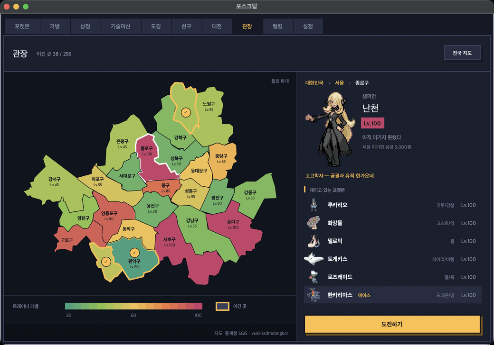
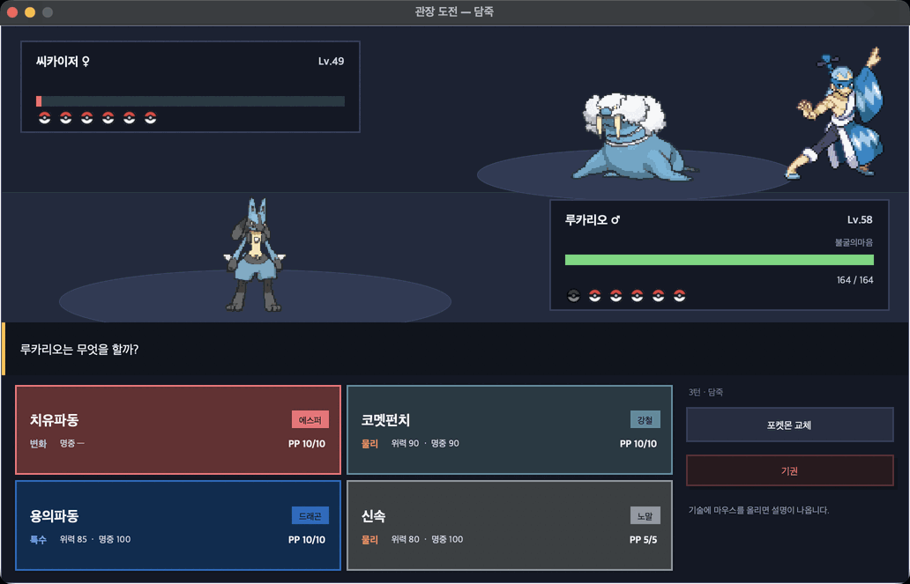
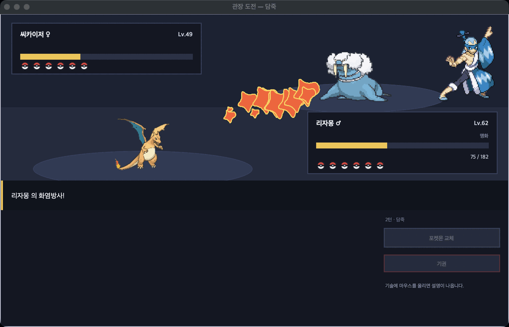
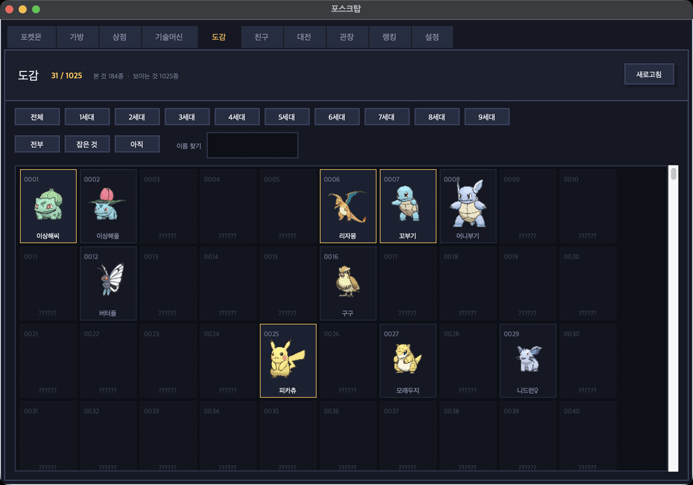
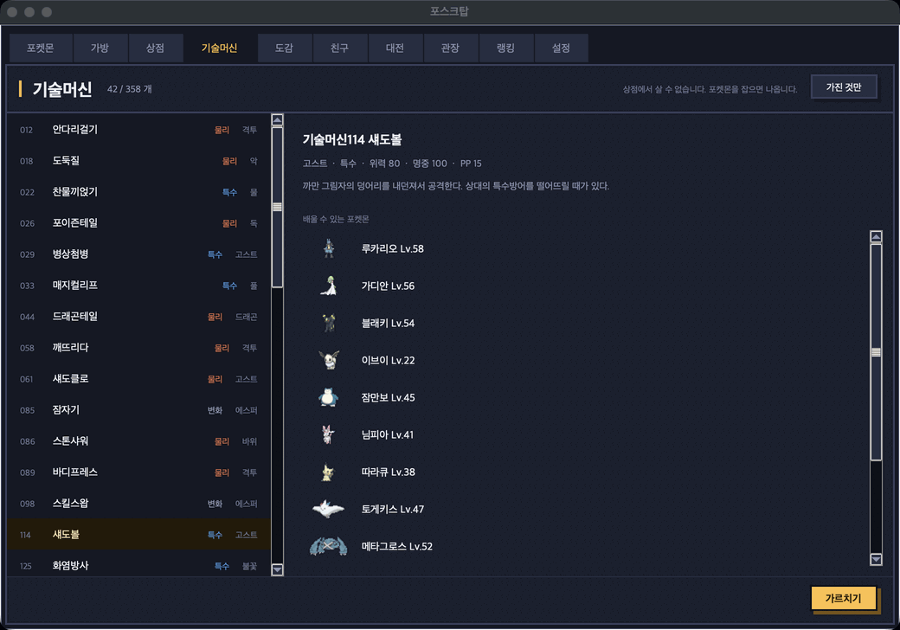
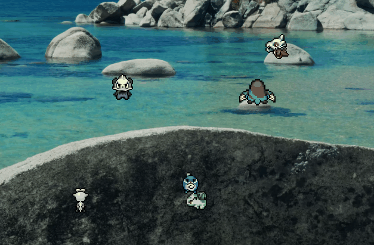
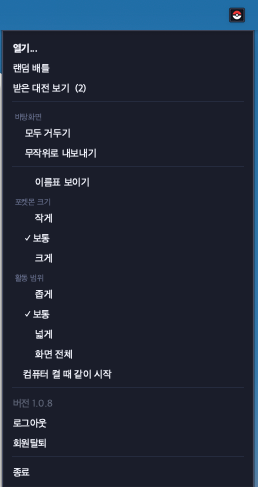
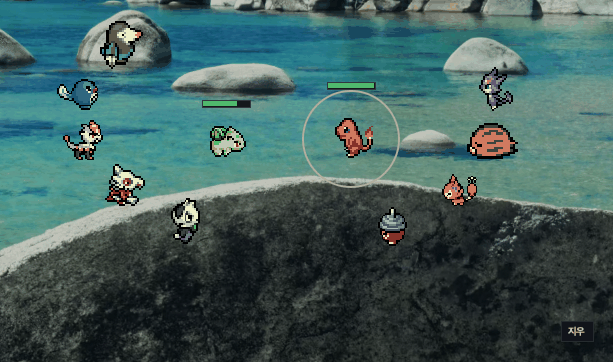

# 포스크탑

**바탕화면에서 포켓몬을 만나고 키웁니다.**

일하는 화면 한켠에서 포켓몬들이 걸어다닙니다.
가끔 풀숲이 돋아나고, 야생 포켓몬이 나타나고, 잡아서 키웁니다.
다 키웠으면 친구와 붙거나, 대한민국 곳곳의 관장에게 도전합니다.

[**최신 버전 받기**](https://github.com/rudtjr1106/poketdesktop/releases/latest) · [쓰인 자료](CREDITS.md)

---

## 진짜로 걸어다닙니다

미끄러지듯 움직이는 게 아니라 **발이 바뀝니다.**
가는 방향에 따라 몸을 돌리고, 위로 올라가면 등이 보입니다. 비스듬히도 걷습니다.
나는 포켓몬은 나는 모습으로 움직입니다.
걸음은 실제로 나아가는 속도에 맞춰 돌아갑니다 — 천천히 가면 발도 천천히 움직입니다.

가만히 서 있을 때도 굳어 있지 않습니다. 숨을 쉬고, 가끔 앉거나 눕습니다.
**한동안 안 건드리면 그 자리에서 잠들고**, 건드리면 일어나서 다시 걷습니다.

1025종 중 982종(야생에 나오는 종 기준 96.8%)에 걷는 도트가 있습니다.
없는 종은 기존 도트로 나오고, 이 경우 걷는 모습 대신 제자리 애니메이션입니다.

## 어떻게 노나요

**5~7분에 한 번 풀숲이 돋아납니다.** 클릭하면 야생 포켓몬이 나옵니다.
가끔은 **꽃이 핀 풀숲**이 돋습니다. 그 안에는 좀처럼 만나기 어려운 포켓몬이
숨어 있습니다 — 무엇인지는 눌러 봐야 압니다.

- **왼쪽 클릭** — 배틀을 겁니다. 내 포켓몬이 다가가서 알아서 싸웁니다
- **오른쪽 클릭** — 던질 볼을 고릅니다
- **두 번 클릭** — 마지막에 쓴 볼로 바로 던집니다

**배틀 중에도 오른쪽 클릭하면 볼을 고릅니다.** 체력을 깎아둔 뒤가 제일
잘 잡히는데, 거기서 볼을 못 고르면 아깝습니다.

볼은 21종입니다. **지금 상황에서 어느 볼이 잘 듣는지 서버가 계산해서
알려줍니다** — 물타입에게 네트볼이면 ×3.5, 레벨이 낮으면 네스트볼이
×3.6 하는 식으로, 배율과 그 이유가 메뉴에 같이 뜹니다.
던지는 볼은 **가방에서 보던 그 볼 그림**으로 날아갑니다.

**알림을 거의 띄우지 않습니다.** 켜 두고 잊어버리는 프로그램이라, 무슨 일이
있을 때마다 화면 구석에서 튀어나오면 하던 일을 방해합니다. 게임 안에서
일어나는 일은 바탕화면에서 눈으로 보입니다 — 풀숲이 흔들리고, 도트가
싸우고, 진화 연출이 돕니다. 알려주는 것은 놓치면 알 길이 없는 것뿐입니다
(새 버전, 친구 요청, 선물).

배틀은 별도 화면 없이 **바탕화면 그 자리에서** 벌어집니다.
서로의 머리 위에 체력바가 뜨고, 기술마다 연출이 나옵니다.

레벨이 오르면 도감대로 기술을 배웁니다. **기술이 이미 네 개면 무엇을 잊을지
직접 고릅니다** — 다섯 기술의 설명과 물리·특수·변화가 한 창에 펼쳐집니다.

파티는 여섯 마리, 넘치면 PC 박스로 갑니다.
개체값·성격·특성·기술 전부 본가와 같은 규칙이고, 특성과 성격을 누르면
무슨 뜻인지 알려줍니다. PC 박스는 **타입으로 거르고 이름으로 찾습니다.**

**줄을 끌어다 놓으면 자리가 바뀝니다.** 박스에 있는 애를 파티 줄에 놓으면
서로 자리를 바꾸고, 파티 안에서 옮기면 순서가 바뀝니다.

### 창이 하나입니다

포켓몬 · 가방 · 상점 · 기술머신 · 도감 · 친구 · 대전 · 관장 · 랭킹 · 설정이
**탭 하나에** 들어 있습니다.
가방을 보다가 상점에 가려고 트레이로 돌아갈 필요가 없습니다.

## 관장에게 도전합니다

**대한민국 시·군·구 256곳마다 트레이너가 한 명씩 기다립니다.**
관장·사천왕·챔피언부터 라이벌과 악의 조직까지, 원작에서 데리고 다니던
포켓몬 그대로 Lv.20~100 에 나눠 두었습니다. 난천은 한카리아스를, 레드는
피카츄를 에이스로 데리고 나옵니다. 어디에 누가 있는지에도 이유가 있습니다.

전국 지도에서 시·도를 누르면 그 안의 시·군·구로 들어갑니다. 레벨이 높을수록
붉게 칠해지고, 이긴 곳에는 금색 테두리가 둘러집니다. **휠로 지도를 키우고
끌어서 옮길 수 있습니다** — 서울의 구처럼 작은 곳도 눌러집니다.
울릉군이나 백령도처럼 멀리 떨어진 섬은 가까이 당겨 그렸습니다.

바탕화면 배틀과 달리 **여기서는 사람이 고릅니다.** 데리고 다니는 포켓몬으로
6:6, 매 턴 기술을 고르거나 포켓몬을 바꿉니다. 한쪽이 전멸할 때까지 갑니다.

<table>
<tr>
<td width="50%"></td>
<td width="50%"></td>
</tr>
</table>

- **기술마다 연출이 나옵니다.** 화염방사는 불길이, 지진은 땅이 갈라지는 식입니다
- **특성이 동작합니다.** 위협·저수·옹골참·변환자재 같은 특성 167가지가 효과를 냅니다
- **상대도 머리를 씁니다.** 먼저 쓰러뜨릴 수 있으면 끝내고, 먼저 맞고 쓰러질 판이면 선공기를 쓰거나 버틸 포켓몬으로 바꿉니다. 안전할 때만 랭크를 올리고, 걸리지 않을 상태이상은 걸지 않습니다
- **관장 포켓몬은 잘 키워져 있습니다.** 개체값이 모두 최고이고, 성격과 노력치도 기술에 맞췄습니다(노력치는 레벨이 높은 트레이너일수록 많습니다). 같은 레벨로는 쉽게 이기지 못합니다
- 붙기 전에는 **상대 포켓몬의 종류와 레벨까지만** 보입니다. 기술과 특성은 싸워 봐야 압니다
- 창을 닫아도 승부는 **한 시간 동안 남아 있어서**, 그 지역을 다시 누르면 이어서 합니다

처음 이긴 곳은 **트레이너 레벨×50원**, 다시 이기면 하루 한 번 레벨×5원을 받습니다.
관장 배틀의 경험치는 야생과 같습니다. 판정은 전부 서버가 합니다.

## 친구와 붙습니다

창을 열고 **친구** 탭에서 닉네임으로 찾아 신청하면 됩니다.
닉네임이 정확히 맞아야 찾아집니다.

- **랜덤 배틀** — 파티 평균 레벨이 ±5 안인 사람과 붙습니다 (없으면 ±10 까지)
- **친구 배틀** — 친구 목록에서 지목합니다

랜덤 배틀은 **오래 안 만난 사람부터** 붙이고, 세 시간 안에 붙은 사람은 건너뜁니다.
평균 레벨을 셀 때 **파티에서 가장 높은 레벨보다 20 넘게 낮은 포켓몬은 뺍니다** —
Lv.1 을 끼워 평균을 깎아도 원래 레벨대의 상대와 붙습니다.

**상대가 켜 두지 않아도 됩니다.** 그 사람의 지금 파티를 그대로 데려와
싸우고, 상대는 다음에 켤 때 결과를 봅니다. 서로 켜져 있기를 기다리면
배틀이 거의 성사되지 않기 때문입니다.

배틀이 시작되면 **바탕화면 그 자리에 투기장이 섭니다.** 양쪽 여섯 마리가
반원으로 모이고, 앞선 둘이 가운데로 나와 싸웁니다. 쓰러지면 다음 선수가
걸어 나오고, 한쪽이 전멸하면 끝납니다. 끝나면 다들 원래대로 돌아갑니다.

싸우는 동안 **상대 닉네임이 오른쪽 아래에 뜹니다.** 특성이 발동하면
포켓몬 위에 특성 이름이 뜨고, 지닌 도구도 효과를 냅니다.

진행은 자동입니다. 기술도 교체도 사람이 고르지 않습니다 — 어떤 팀을
키웠는지로 승부가 갈립니다.

다만 **아무나 순서대로 내보내지는 않습니다.** 쓰러지면 다음 선수를
상성을 보고 고릅니다 — 내 기술이 상대에게 얼마나 박히는지, 상대 기술이
나를 얼마나 아프게 하는지를 재서 제일 나은 애가 나옵니다. 특성 때문에
안 먹히는 기술(부유에게 땅 기술 같은)은 없는 셈 칩니다.
순서대로 내보내는 방식과 600판을 붙여 보니 **57% 를 이겼습니다.**

**내가 건 판을 이기면 500원**을 받습니다(친구 배틀은 절반). 걸려온 판과
진 판은 상금이 없습니다 — 누워 있는 편이 이득이면 안 되니까요.
하루에 걸 수 있는 판은 20판, 대전으로 받는 돈은 하루 6,000원까지입니다.
랜덤 배틀은 점수가 오르내리고, 다섯 판을 채우면 **랭킹** 탭의 순위표에 오릅니다.

## 본가 그대로

| | |
|---|---|
| **1~9세대 1025마리** | 타입·종족값·기술·특성 전부 정식 도감 자료 |
| **개체값 · 성격 · 특성** | 3세대 이후 능력치 공식 그대로 |
| **특성** | 관장 배틀과 유저 배틀에서 167가지가 효과를 냅니다 (야생 배틀은 끔) |
| **지닌 도구** | 121종. 야생·유저·관장 배틀 모두에서 효과를 냅니다 |
| **기술머신** | 358개. 기술이 네 개면 무엇을 잊을지 고릅니다 |
| **경험치** | 5세대 공식. 학습장치로 파티 전원이 나눠 받습니다 |
| **노력치** | 스탯당 252, 총합 510 |
| **진화** | 레벨 · 돌 · 친밀도 · 특정 기술. 이브이 여덟 갈래도 조건대로. 교환진화는 도구로 |
| **친밀도** | 바탕화면에 데리고 다닌 시간만큼 오릅니다 |
| **포획** | 5세대 이후 공식. 볼 종류마다 상황을 봅니다 |
| **이로치** | 4096분의 1 |

전설의 포켓몬은 야생에 나오지 않습니다. 대신 사천왕·조직 보스 같은
트레이너 몇몇이 원작처럼 데리고 나옵니다.

## 도감

만난 포켓몬이 도감에 남습니다. **1025종 전부** 있고, 세대별로 얼마나
채웠는지 보여줍니다. 본 적 없는 종은 이름이 가려져 있고, 진화시킨
포켓몬도 바로 올라갑니다.

## 기술머신

**358개**가 있습니다. 상점에서는 살 수 없고 포켓몬을 잡으면 나옵니다.
하나를 고르면 가진 포켓몬 중 **누가 배울 수 있는지** 바로 보이고,
기술의 위력·명중·설명이 같이 나옵니다. 써도 없어지지 않습니다.

## 도구와 상점

야생을 잡거나 쓰러뜨리면 **가끔 도구가 떨어집니다.** 212종이 있습니다.

흔한 건 자주, 귀한 건 가끔 나옵니다.
안 쓰는 건 상점이나 가방에서 바로 팔아 돈을 만들고, 그 돈으로 필요한 걸 삽니다.
돈은 도구를 팔거나, 대전과 관장에게 이겨서 법니다.

- **지닌 도구 121종** — 목탄·먹다남은음식·생명의구슬·구애스카프 같은 것들입니다.
  **얼마나 올려 주는지 수치로 보입니다** (목탄: 불꽃 타입 기술의 위력이 20% 올라간다)
- **진화의 돌** — 이브이를 여덟 갈래 중 어디로 보낼지 고릅니다.
  교환으로 진화하던 포켓몬은 연결의끈·금속코트 같은 도구로 진화합니다
- **영양제 · 깃털 · 열매** — 노력치를 올리고 내립니다
- **은색/금색 병뚜껑** — 레벨 50부터 개체값을 최고로 단련합니다
- **이상한사탕 · 변함없는돌** — 레벨을 올리고, 진화를 멈춥니다

## 도구가 떨어질 확률

**잡으면 30%, 쓰러뜨리면 45%** 로 도구가 하나 떨어집니다.
잡으면 포켓몬이라는 보상이 이미 있어서 쓰러뜨릴 때보다 낮습니다.
212종 중 205종이 나옵니다.
이로치를 잡으면 여러 번 뽑아 그중 제일 귀한 것을 줍니다.

| 등급 | 종류 | 나올 확률 | 한 종당 |
|---|---:|---:|---:|
| 흔함 | 61종 | 62.3% | 1.022% |
| 보통 | 57종 | 26.2% | 0.460% |
| 희귀 | 71종 | 10.2% | 0.143% |
| 매우 희귀 | 14종 | 1.2% | 0.051~0.347% |
| 전설 | 2종 | 0.1% | 0.020~0.092% |

눈여겨볼 것들입니다. **하루 8시간 켜두고 55번쯤 만나** 절반은 잡고
절반은 쓰러뜨린다고 쳤을 때입니다 (하루에 20개쯤 떨어집니다).

| 도구 | 확률 | 얼마 만에 하나 | 팔면 |
|---|---:|---:|---:|
| 몬스터볼 | 1.022% | 4.7일에 하나 | 100원 |
| 하이퍼볼 | 0.143% | 33.9일에 하나 | 400원 |
| 은색병뚜껑 | 0.347% | 14.0일에 하나 | 2,500원 |
| 이상한사탕 | 0.204% | 23.7일에 하나 | 5,000원 |
| 금색병뚜껑 | 0.092% | 52.7일에 하나 | 5,000원 |
| 마스터볼 | 0.020% | 237.3일에 하나 | 0원 |
| 불꽃의돌 | 0.143% | 33.9일에 하나 | 1,500원 |
| 연결의끈 | 0.051% | 94.9일에 하나 | 4,000원 |
| 먹다남은음식 | 0.051% | 94.9일에 하나 | 7,500원 |

드랍 하나의 기대 판매가는 **1,003원**, 하루에 **20,000원**쯤입니다.
몬스터볼이 200원이니 잡으러 다니는 것만으로 볼값은 넉넉히 나옵니다.

## 시작하기

**윈도우**

1. [릴리스](https://github.com/rudtjr1106/poketdesktop/releases/latest)에서 `poketdesktop-vX.Y.Z.zip` 을 받습니다
2. 압축을 풀고 안의 exe 를 실행합니다
3. **닉네임 + 숫자 4자리**로 가입하고, 1~9세대 스타팅 27마리 중 하나를 고릅니다

**맥** (Apple 실리콘)

1. [릴리스](https://github.com/rudtjr1106/poketdesktop/releases/latest)에서 `poketdesktop-vX.Y.Z-mac.dmg` 를 받습니다
2. 열어서 **포스크탑**을 옆의 `Applications` 로 끌어다 놓습니다
3. 두 번 눌러 실행합니다. **경고 없이 그냥 열립니다** — 애플 공증을
   받았습니다

윈도우와 맥이 **같은 서버**를 씁니다. 친구도 되고 대전도 됩니다.

**한 번 받으면 그 다음부터는 신경 쓸 게 없습니다.** 새 버전이 나오면
켤 때 알아서 받아서 다시 시작하고, 무엇이 바뀌었는지 한 번 보여줍니다.

**컴퓨터를 켜면 같이 시작합니다.** 바탕화면에서 포켓몬이 걸어다니는 게
전부인 프로그램이라, 켤 때마다 손으로 켜야 하면 며칠 만에 안 켜게 됩니다.

등록은 **로그인에 성공한 뒤에** 합니다. 받아서 열어만 보고 가입은 안 한
사람까지 부팅 목록에 넣지 않으려는 것입니다. **로그아웃하거나 회원탈퇴하면
등록도 같이 떼어냅니다.**

싫으면 언제든 끕니다. **설정 창**이나 **트레이 메뉴**에서 체크를 풀거나,
**작업 관리자 > 시작 프로그램**(맥은 **시스템 설정 > 일반 > 로그인 항목**)
에서 꺼도 됩니다. 거기서 끈 것은 프로그램이
다시 켜지 않습니다. 숨겨 두지도 않았습니다 - 시작 프로그램 목록에 그대로
보입니다.

> **폴더째 지웠다면**
>
> 이 프로그램은 설치 프로그램이 없어서(그냥 압축을 푸는 것입니다) 지우는
> 것도 폴더를 버리는 것으로 끝납니다. 다만 그러면 **켜기 전에 자동 시작을
> 먼저 꺼 주세요.** 폴더가 사라진 뒤에는 프로그램이 스스로 등록을 뗄 수가
> 없어서, 시작 프로그램 목록에 이름만 남습니다(없는 파일을 가리키므로
> 실제로 뜨지는 않습니다).
>
> 이미 지우셨다면 **작업 관리자 > 시작 프로그램**에서 `poketdesktop` 을
> 사용 안 함으로 두면 됩니다. 완전히 지우려면 레지스트리 편집기에서
> `HKEY_CURRENT_USER\Software\Microsoft\Windows\CurrentVersion\Run` 의
> `poketdesktop` 값을 지우고, `%APPDATA%\poketdesktop` 폴더도 버리면 됩니다.

서버 주소를 입력할 필요 없습니다. 설치도 필요 없습니다.
트레이 아이콘에서 포켓몬 관리 · 가방 · 상점 · 관장을 열 수 있습니다.

> **보안 경고가 뜬다면**
>
> **"Windows에서 PC를 보호했습니다"** — SmartScreen 입니다.
> **추가 정보 → 실행** 을 누르면 되고, 그 다음부터는 안 뜹니다.
>
> **백신이 파일을 지우거나 실행을 막는다면** — 오탐입니다.
> 릴리스의 **`.zip` (폴더형)** 을 받아 보세요. 단일 exe 는 실행할 때 자기를
> 임시 폴더에 풀고 돌리는데, 그 동작이 악성코드와 비슷해 보여서 오탐이 잦습니다.
> 폴더형은 이미 풀린 상태라 훨씬 덜 걸립니다.
>
> 둘 다 코드 서명 인증서(연 수십만원)가 없어서 생기는 일이고, 프로그램 문제가 아닙니다.
> 자세한 대처는 [백신 오탐 안내](docs/defender-false-positive.md)를 보세요.
>
> **파일을 카카오톡이나 메일로 받으면 더 엄격하게 검사받습니다.**
> 위 릴리스 주소에서 직접 받는 편이 훨씬 덜 걸립니다.

## 맥에서도 돌아갑니다

바탕화면 위를 걸어다니는 것도, 잡고 키우고 붙는 것도 윈도우와 똑같습니다.
도트만 남고 창은 보이지 않습니다 — 맥에는 윈도우의 '이 색을 뚫어라' 가
없어서, 창을 통째로 투명하게 만들고 도트는 CALayer 로 직접 그립니다.
덕분에 색빼기가 아니라 진짜 알파라서 가장자리가 깔끔합니다.
글자는 맥에서 한 단계 크게 나옵니다.

<table>
<tr>
<td width="52%" valign="top">

**Dock 에 안 뜹니다. 메뉴 막대에 있습니다.**

화면 위쪽 메뉴 막대의 **몬스터볼 아이콘**이 이 게임의 메뉴입니다.
포켓몬 관리 · 가방 · 상점 · 관장 · 설정이 전부 거기서 열립니다. 켜 두고
잊어버리는 프로그램이라 Dock 한 칸을 계속 차지하지 않게 했습니다.

이 메뉴는 맥의 기본 메뉴가 아니라 **직접 그린 것**입니다. 맥에서 기본
메뉴(NSMenu)를 열면 그 동안 도트를 움직이는 타이머와 부딪혀 앱이
죽어버립니다.

**오른쪽 클릭은 두 손가락 클릭입니다.**

`Control` + 클릭도 됩니다. 내 포켓몬을 오른쪽 클릭하면 메뉴가, 야생
포켓몬을 오른쪽 클릭하면 몬스터볼을 던집니다.

**자동 업데이트는 윈도우와 같습니다.**

켤 때 새 버전이 있으면 알아서 받습니다. 다만 받는 것이 다릅니다 —
윈도우는 폴더를 옆에 풀고, 맥은 dmg 를 받아 **앱을 통째로 갈아끼웁니다.**
돌고 있는 번들은 그 자리에서 못 바꾸기 때문에, 프로그램이 끝나기를
기다렸다가 바꾸고 다시 띄웁니다.

</td>
<td width="48%" align="center" valign="top">

</td>
</tr>
</table>

투기장도 그대로 돕니다. 여섯 마리가 바탕화면에서 붙고, 체력바와 기술
이펙트가 도트 위에 겹쳐 그려집니다.

이식에서 무엇이 막혔고 어떻게 풀었는지는
[맥에서 개발하기](docs/맥에서-개발하기.md) 에 적어 두었습니다 —
투명 배경, 메뉴 막대, 클릭 통과, 노트북을 닫았다 열 때 같은 것들입니다.

## 앞으로

- 전설의 포켓몬 이벤트
- **윈도우 서명** — 맥은 공증까지 붙어서 경고 없이 열립니다. 윈도우는
  아직 SmartScreen 이 한 번 막습니다 (코드 서명 인증서가 따로 필요합니다)

## 문서

| | |
|---|---|
| [맥에서 개발하기](docs/맥에서-개발하기.md) | 맥에서 돌리고 고치고 `.app` 으로 묶기. 맥에서 물렸던 것들 |
| [운영](docs/운영.md) | 서버 배포·백업·되살리기·DB 들여다보기 |
| [선물 보내기](docs/선물-보내기.md) | 운영자가 도구·돈·볼을 보내는 법 (받는 사람에게 창이 뜬다) |
| [AWS 이전](docs/AWS이전.md) | 서울 서버를 처음부터 세우는 절차 |
| [백신 오탐](docs/defender-false-positive.md) | SmartScreen·백신 경고가 뜰 때 |

---

포켓몬은 닌텐도 / Game Freak / 포켓몬 컴퍼니의 저작물입니다.
이 프로젝트는 팬이 만든 **비상업** 프로젝트입니다.

걷는 도트는 [PMDCollab/SpriteCollab](https://github.com/PMDCollab/SpriteCollab)
([CC BY-NC 4.0](https://creativecommons.org/licenses/by-nc/4.0/)) 을 씁니다.
관장 지도는 통계청 SGIS 행정경계를 가공한
[vuski/admdongkor](https://github.com/vuski/admdongkor)
([CC BY 4.0](https://creativecommons.org/licenses/by/4.0/)) 입니다.
자세한 출처는 [CREDITS.md](CREDITS.md) 에 있습니다.

