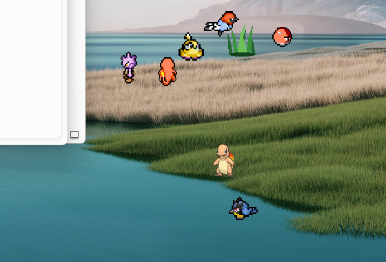
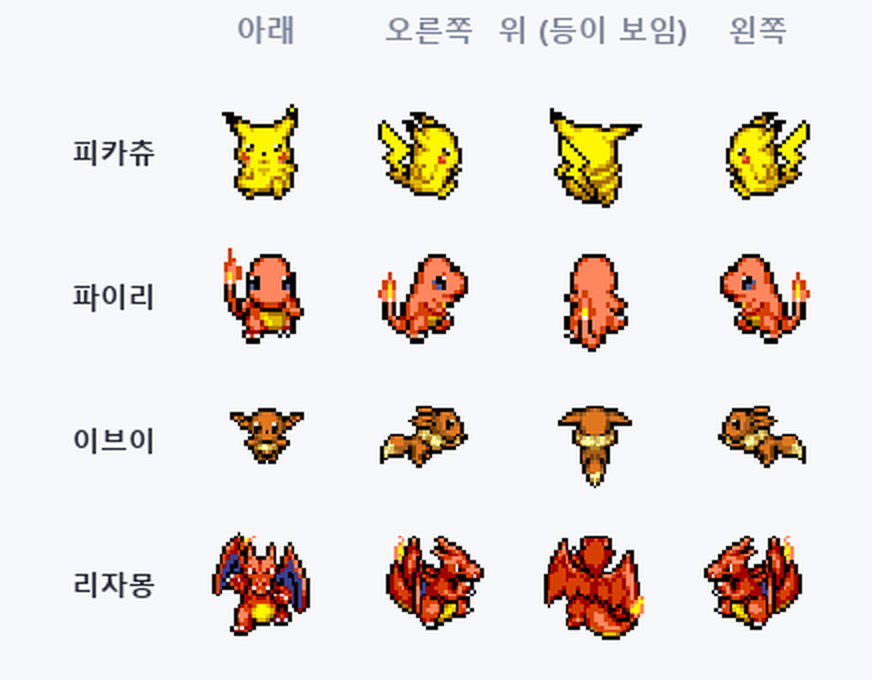
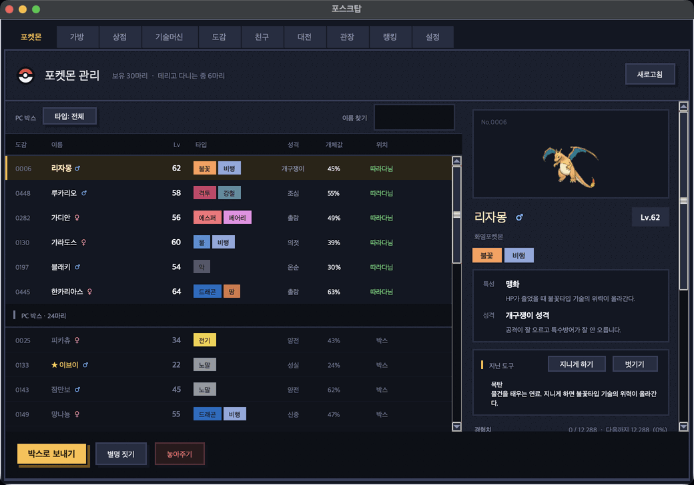
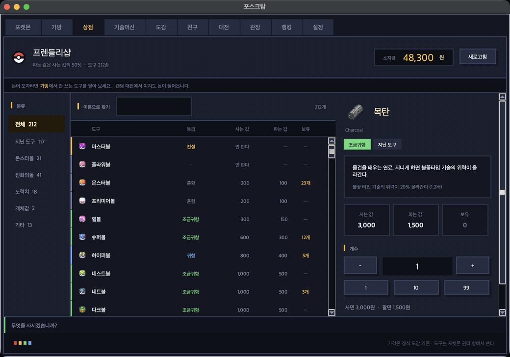
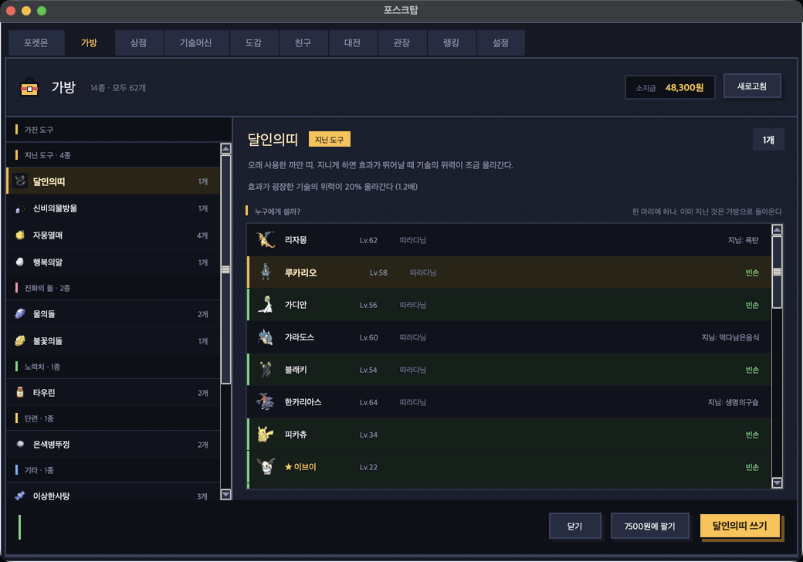
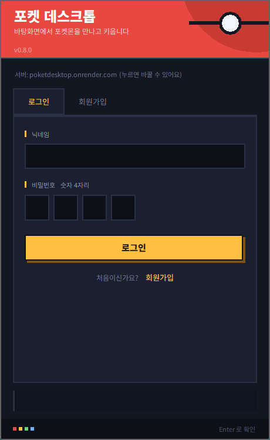

# 포켓 데스크톱

**바탕화면에서 포켓몬을 만나고 키웁니다.**

일하는 화면 한켠에서 포켓몬들이 걸어다닙니다.
가끔 풀숲이 돋아나고, 야생 포켓몬이 나타나고, 잡아서 키웁니다.

[**최신 버전 받기**](https://github.com/rudtjr1106/poketdesktop/releases/latest) · [쓰인 자료](CREDITS.md)

---

## 진짜로 걸어다닙니다

미끄러지듯 움직이는 게 아니라 **발이 바뀝니다.**
가는 방향에 따라 몸을 돌리고, 위로 올라가면 등이 보입니다.
나는 포켓몬은 나는 모습으로 움직입니다.
걸음은 실제로 나아가는 속도에 맞춰 돌아갑니다 — 천천히 가면 발도 천천히 움직입니다.

1025종 중 982종(야생에 나오는 종 기준 96.8%)에 걷는 도트가 있습니다.
없는 종은 기존 도트로 나오고, 이 경우 걷는 모습 대신 제자리 애니메이션입니다.

## 어떻게 노나요

**5~7분에 한 번 풀숲이 돋아납니다.** 클릭하면 야생 포켓몬이 나옵니다.

- **왼쪽 클릭** — 배틀을 겁니다. 내 포켓몬이 다가가서 알아서 싸웁니다
- **오른쪽 클릭** — 던질 볼을 고릅니다
- **두 번 클릭** — 마지막에 쓴 볼로 바로 던집니다

볼은 20종입니다. **지금 상황에서 어느 볼이 잘 듣는지 서버가 계산해서
알려줍니다** — 물타입에게 네트볼이면 ×3.5, 레벨이 낮으면 네스트볼이
×3.6 하는 식으로, 배율과 그 이유가 메뉴에 같이 뜹니다.

**알림을 띄우지 않습니다.** 켜 두고 잊어버리는 프로그램이라, 무슨 일이
있을 때마다 화면 구석에서 튀어나오면 하던 일을 방해합니다. 게임 안에서
일어나는 일은 바탕화면에서 눈으로 보입니다 — 풀숲이 흔들리고, 도트가
싸우고, 진화 연출이 돕니다. 놓치면 안 되는 것은 트레이 메뉴에 남습니다.

배틀은 별도 화면 없이 **바탕화면 그 자리에서** 벌어집니다.
서로의 머리 위에 체력바가 뜨고, 체력을 깎아두면 훨씬 잘 잡힙니다.

레벨이 오르면 도감대로 기술을 배웁니다. 기술이 네 개 차면 가장 오래된 것이
밀려나는데, 무엇을 잊었는지 알림으로 알려줍니다.

파티는 여섯 마리, 넘치면 PC 박스로 갑니다.
개체값·성격·특성·기술 전부 본가와 같은 규칙입니다.

## 친구와 붙습니다

트레이에서 **친구**를 열고 닉네임으로 찾아 신청하면 됩니다.
닉네임이 정확히 맞아야 찾아집니다.

- **랜덤 배틀** — 비슷한 레벨대의 누군가와 붙습니다
- **친구 배틀** — 친구 목록에서 지목합니다

**상대가 켜 두지 않아도 됩니다.** 그 사람의 지금 파티를 그대로 데려와
싸우고, 상대는 다음에 켤 때 결과를 봅니다. 서로 켜져 있기를 기다리면
배틀이 거의 성사되지 않기 때문입니다.

배틀이 시작되면 **바탕화면 그 자리에 투기장이 섭니다.** 양쪽 여섯 마리가
반원으로 모이고, 앞선 둘이 가운데로 나와 싸웁니다. 쓰러지면 다음 선수가
걸어 나오고, 한쪽이 전멸하면 끝납니다. 끝나면 다들 원래대로 돌아갑니다.

진행은 자동입니다. 기술도 교체도 사람이 고르지 않습니다 — 어떤 팀을
키웠는지로 승부가 갈립니다.

이기면 1,000원, 비기면 500원, 져도 300원을 받습니다(친구 배틀은 절반).
하루에 받을 수 있는 상금과 걸 수 있는 판수에는 상한이 있습니다.
랜덤 배틀은 점수가 오르내리고, 다섯 판을 채우면 순위표에 오릅니다.

## 본가 그대로

| | |
|---|---|
| **1~9세대 1025마리** | 타입·종족값·기술·특성 전부 정식 도감 자료 |
| **개체값 · 성격 · 특성** | 3세대 이후 능력치 공식 그대로 |
| **경험치** | 5세대 공식. 학습장치로 파티 전원이 나눠 받습니다 |
| **노력치** | 스탯당 252, 총합 510 |
| **진화** | 레벨 · 돌 · 친밀도 · 특정 기술. 이브이 여덟 갈래도 조건대로 |
| **친밀도** | 바탕화면에 데리고 다닌 시간만큼 오릅니다 |
| **포획** | 5세대 이후 공식. 볼 종류마다 상황을 봅니다 |
| **이로치** | 4096분의 1 |

전설의 포켓몬은 야생에 나오지 않습니다. 나중에 이벤트로 넣을 예정입니다.

## 도감

만난 포켓몬이 도감에 남습니다. **1025종 전부** 있고, 세대별로 얼마나
채웠는지 보여줍니다. 본 적 없는 종은 이름이 가려져 있습니다.

## 도구와 상점

야생을 잡거나 쓰러뜨리면 **도구가 떨어집니다.** 94종이 있습니다.

흔한 건 자주, 귀한 건 가끔 나옵니다.
안 쓰는 건 상점에 팔아 돈을 만들고, 그 돈으로 필요한 걸 삽니다.
**돈은 도구를 팔아서만 법니다.**

- **진화의 돌** — 이브이를 여덟 갈래 중 어디로 보낼지 고릅니다
- **영양제 · 깃털 · 열매** — 노력치를 올리고 내립니다
- **은색/금색 병뚜껑** — 레벨 50부터 개체값을 최고로 단련합니다
- **이상한사탕 · 변함없는돌** — 레벨을 올리고, 진화를 멈춥니다

## 도구가 떨어질 확률

야생을 **잡거나 쓰러뜨리면** 도구가 하나 떨어집니다. 94종 중 88종이 나옵니다.
이로치를 잡으면 여러 번 뽑아 그중 제일 귀한 것을 줍니다.

| 등급 | 종류 | 나올 확률 | 한 종당 |
|---|---:|---:|---:|
| 흔함 | 18종 | 53.4% | 2.969~2.969% |
| 조금 귀함 | 20종 | 26.7% | 1.336~1.336% |
| 귀함 | 41종 | 17.0% | 0.416~0.416% |
| 매우 귀함 | 7종 | 2.5% | 0.148~1.010% |
| 전설 | 2종 | 0.3% | 0.059~0.267% |

눈여겨볼 것들입니다. **하루 8시간 켜두고 55번쯤 만난다고** 쳤을 때입니다.

| 도구 | 확률 | 얼마 만에 하나 | 팔면 |
|---|---:|---:|---:|
| 몬스터볼 | 2.969% | 하루 1.6개 | 100원 |
| 하이퍼볼 | 0.416% | 4.4일에 하나 | 400원 |
| 은색병뚜껑 | 1.010% | 1.8일에 하나 | 2,500원 |
| 이상한사탕 | 0.594% | 3.1일에 하나 | 5,000원 |
| 금색병뚜껑 | 0.267% | 6.8일에 하나 | 5,000원 |
| 마스터볼 | 0.059% | 30.6일에 하나 | 0원 |
| 불꽃의돌 | 0.416% | 4.4일에 하나 | 1,500원 |
| 연결의끈 | 0.148% | 12.2일에 하나 | 4,000원 |

드랍 하나의 기대 판매가는 **852원**입니다. 몬스터볼이 200원이니,
잡으러 다니는 것만으로 볼값은 나옵니다.

## 시작하기

1. [릴리스](https://github.com/rudtjr1106/poketdesktop/releases/latest)에서 `poketdesktop-vX.Y.Z.zip` 을 받습니다
2. 압축을 풀고 안의 exe 를 실행합니다
3. **닉네임 + 숫자 4자리**로 가입하고, 1~9세대 스타팅 27마리 중 하나를 고릅니다

**한 번 받으면 그 다음부터는 신경 쓸 게 없습니다.** 새 버전이 나오면
켤 때 알아서 받아서 다시 시작합니다.

서버 주소를 입력할 필요 없습니다. 설치도 필요 없습니다.
트레이 아이콘에서 포켓몬 관리 · 가방 · 상점을 열 수 있습니다.

> **보안 경고가 뜬다면**
>
> **"Windows에서 PC를 보호했습니다"** — SmartScreen 입니다.
> **추가 정보 → 실행** 을 누르면 되고, 그 다음부터는 안 뜹니다.
>
> **백신이 파일을 지우거나 실행을 막는다면** — 오탐입니다.
> 릴리스의 **`.zip` (폴더형)** 을 받아 보세요. 단일 exe 는 실행할 때 자기를
> 임시 폴더에 풀고 돌리는데, 그 동작이 악성코드와 비슷해 보여서 오탐이 잦습니다.
> 폴더형은 이미 풀린 상태라 훨씬 덜 걸립니다.
>
> 둘 다 코드 서명 인증서(연 수십만원)가 없어서 생기는 일이고, 프로그램 문제가 아닙니다.
> 자세한 대처는 [백신 오탐 안내](docs/defender-false-positive.md)를 보세요.
>
> **파일을 카카오톡이나 메일로 받으면 더 엄격하게 검사받습니다.**
> 위 릴리스 주소에서 직접 받는 편이 훨씬 덜 걸립니다.

## 앞으로

- 체육관
- 전설의 포켓몬 이벤트

---

포켓몬은 닌텐도 / Game Freak / 포켓몬 컴퍼니의 저작물입니다.
이 프로젝트는 팬이 만든 **비상업** 프로젝트입니다.

걷는 도트는 [PMDCollab/SpriteCollab](https://github.com/PMDCollab/SpriteCollab)
([CC BY-NC 4.0](https://creativecommons.org/licenses/by-nc/4.0/)) 을 씁니다.
자세한 출처는 [CREDITS.md](CREDITS.md) 에 있습니다.

